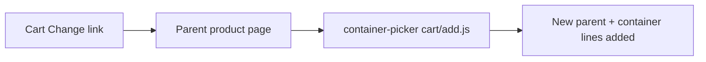
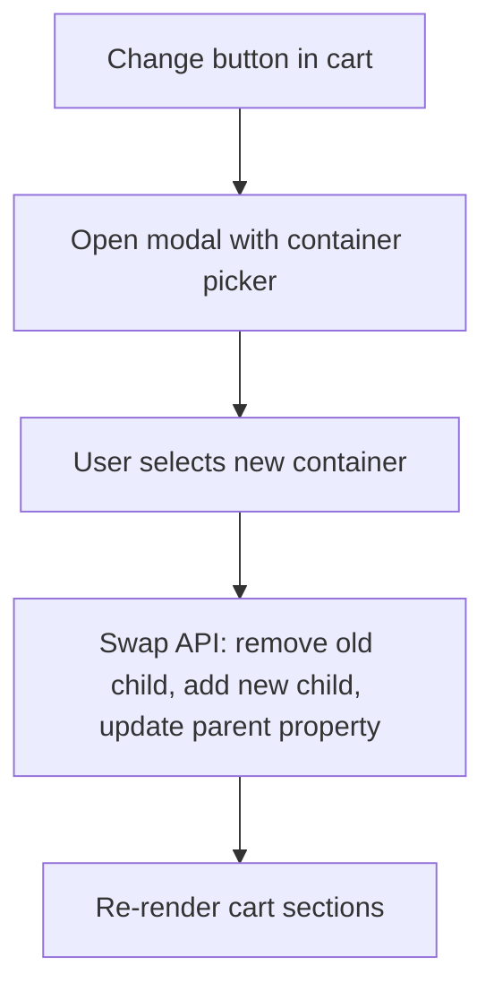

# Cart Container Change (Option 1)

## Recommendation

**Option 1 (in-cart picker) is the right approach.** Option 2 would still require the same cart-swap logic, plus URL/state management and overriding the product page add-to-cart flow — which is why duplicates happen today (the picker always calls `cart/add.js` with new lines).

Option 1 keeps the user in context, uses the exact parent/child line keys already available in the cart, and reuses [`snippets/container-picker.liquid`](snippets/container-picker.liquid) + [`assets/container-picker.js`](assets/container-picker.js).

**UI:** Modal overlay (matches existing [`snippets/popup-container-detail.liquid`](snippets/popup-container-detail.liquid) pattern; no cart layout surgery).

---

## Current behavior (the bug)

The Change link in [`snippets/cart-child-item.liquid`](snippets/cart-child-item.liquid) and [`snippets/drawer-child-item.liquid`](snippets/drawer-child-item.liquid) is a plain `<a href="{{ container_parent_url }}">` with no cart context. Re-adding from the PDP creates a second bundle instead of replacing the existing one.

---

## Target behavior

---

## Shopify API constraints

Nested cart line parent relationships are **immutable** — you cannot retarget an existing container line to a new variant. Swapping requires:

1. **Remove** old container line: `POST cart/change.js` with `{ id: containerLineKey, quantity: 0 }`
2. **Add** new container nested under existing parent: `POST cart/add.js` with `{ items: [{ id: newVariantId, quantity, parent_line_key: parentLineKey, properties: { _is_container, _parent_variant_id } }] }`
   - Use `parent_line_key` (not `parent_id`) because the parent already exists in cart
3. **Update** parent display property: `POST cart/change.js` with `{ id: parentLineKey, properties: { 'Selected Container': 'Title (+ $price)' } }`

If the user selects the same container, close modal with no API calls.

---

## Implementation plan

### 1. Replace Change link with a data-rich button

In both cart child snippets, replace the `<a href>` with a `<button type="button">` carrying cart context:

| Data attribute | Source |
|---|---|
| `data-parent-line-key` | `item.parent_relationship.parent.key` |
| `data-container-line-key` | `item.key` |
| `data-parent-variant-id` | `item.parent_relationship.parent.variant_id` |
| `data-parent-product-handle` | `item.parent_relationship.parent.product.handle` |
| `data-current-container-variant-id` | `item.variant.id` |
| `data-quantity` | `item.parent_relationship.parent.quantity` |

Files: [`snippets/cart-child-item.liquid`](snippets/cart-child-item.liquid), [`snippets/drawer-child-item.liquid`](snippets/drawer-child-item.liquid)

### 2. Add cart container change modal shell

New snippet (e.g. `snippets/popup-cart-container-change.liquid`) rendered globally in [`layout/theme.liquid`](layout/theme.liquid) alongside the existing container detail popup.

- Alpine store `xPopupCartContainerChange` (same pattern as `xPopupContainerDetail` in [`assets/container-picker.js`](assets/container-picker.js))
- Modal states: loading → picker content → error
- Title: "Change container for {tree name}"
- Footer: **Update container** (primary) + Cancel

### 3. Section for lazy-loading the picker

New section [`sections/cart-container-picker.liquid`](sections/cart-container-picker.liquid):

- Renders `container-picker` snippet in **change mode** (no product form dependency)
- Fetched via Section Rendering API: `GET /products/{handle}?section_id=cart-container-picker`
- Pass `data-mode="change"` and a unique `section_id` (e.g. `cart-change`)

Extend [`snippets/container-picker.liquid`](snippets/container-picker.liquid) to accept optional params:
- `mode: 'add' | 'change'` (default `'add'`)
- `product_form_id` optional when `mode == 'change'`

### 4. Extend `container-picker.js` for change mode

In [`assets/container-picker.js`](assets/container-picker.js):

- **`data-mode="change"`**: skip `_interceptProductForm()`; show modal footer confirm button instead
- **`swapContainerInCart(context)`** new method:
  - Accept `{ parentLineKey, containerLineKey, parentVariantId, quantity, selected }`
  - Run the 3-step API sequence above
  - Re-render via `Alpine.store('xCartHelper').reRenderSections()` (same as existing add flow)
  - Dispatch `eurus:cart:items-changed`
- On modal open: call existing `selectVariant(currentContainerVariantId)` to pre-select current container

### 5. Wire up click handler

New small module [`assets/cart-container-change.js`](assets/cart-container-change.js) (or extend [`assets/theme.js`](assets/theme.js)):

- Delegated click listener on `.cart-item__container-change-btn`
- Read data attributes → open Alpine modal → fetch picker section HTML → inject into modal body
- Bind **Update container** to `picker.swapContainerInCart(...)`

### 6. Load assets globally on cart surfaces

Today `container-picker.js` + CSS load only when the picker snippet renders on PDP ([`snippets/container-picker.liquid`](snippets/container-picker.liquid) line 124).

For cart modal to work, load globally in [`layout/theme.liquid`](layout/theme.liquid):

- `component-container-picker.css`
- `container-picker.js`
- `cart-container-change.js`

(alternatively: load only when cart drawer is present + on `/cart` page — slightly more complex, marginal savings)

---

## Files to create / modify

| File | Action |
|---|---|
| `snippets/popup-cart-container-change.liquid` | **Create** — modal shell |
| `sections/cart-container-picker.liquid` | **Create** — lazy-loaded picker section |
| `assets/cart-container-change.js` | **Create** — click handler + section fetch |
| `assets/container-picker.js` | **Modify** — change mode + swap API |
| `snippets/container-picker.liquid` | **Modify** — support change mode param |
| `snippets/cart-child-item.liquid` | **Modify** — button + data attrs |
| `snippets/drawer-child-item.liquid` | **Modify** — button + data attrs |
| `layout/theme.liquid` | **Modify** — render modal + load JS/CSS |

---

## Edge cases to handle

- **Same container selected:** no-op, close modal
- **Unavailable container:** existing picker availability UI already blocks selection
- **API failure:** show error in modal, leave cart unchanged
- **Loading state:** disable Update button during swap; show spinner
- **Parent `Selected Container` property:** must update so parent line display + order emails stay in sync ([`tmp/email-order-conf.liquid`](tmp/email-order-conf.liquid) reads this property)
- **Quantity:** new container qty = parent qty (from `data-quantity`)
- **Multiple same tree products in cart:** line keys disambiguate bundles correctly (each Change button carries its own parent key)

---

## Why not Option 2

| | Option 1 (in-cart modal) | Option 2 (PDP pre-populate) |
|---|---|---|
| Cart swap logic | Required once | Still required |
| Prevent duplicates | Natural — never calls add for parent | Must detect "edit mode" and override add flow |
| State passing | Line keys on button | URL params / sessionStorage |
| UX | Stays in cart | Leaves cart, re-navigates |
| Reuses picker | Yes (lazy-loaded section) | Yes (already on PDP) |

Option 2 only wins if you also want the user to change tree variant/size during the edit — out of scope for "change container."

---

## Test plan

1. Add tree + container to cart from PDP
2. On `/cart` and in cart drawer, click **Change** → modal opens with current container pre-selected
3. Select different container → **Update container** → cart shows one parent + one new container (no duplicates)
4. Parent line shows updated "Selected Container" property text
5. Parent qty change still syncs container qty ([`_syncContainerQty`](assets/theme.js) — existing behavior)
6. Select same container → modal closes, cart unchanged
7. Remove parent → container removed automatically (Shopify nested line behavior)
