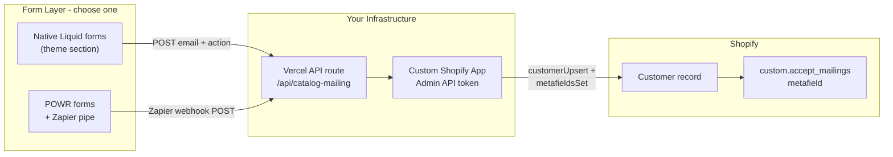
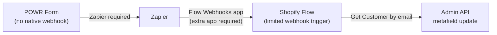
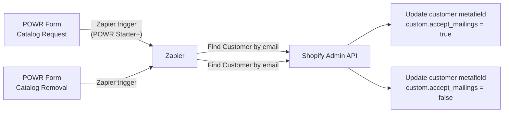

# Catalog Form → Customer Metafield Update

## Context

The catalog request and removal forms currently live as page content in **Shopify Admin** (not in theme files). The goal is to set a custom customer metafield (e.g. `custom.accept_mailings`) to `true` or `false` when a customer submits either form.

## POWR "Shopify Customers" Integration — Not Usable for This

The integration shown in the POWR dashboard (Integrations → Shopify → "Connect Shopify Customers") is **not** a per-form field mapper. It is a bulk sync from **POWR Contacts** into **Shopify Customers**.

Per [POWR's official docs](https://help.powr.io/hc/en-us/articles/1500007778401-POWR-Contacts-Explained), POWR Contacts only stores:

- Email (required)
- First name, last name
- Address, phone number
- Tags and notes (manual, in POWR dashboard — not synced from form fields)

The Shopify sync creates/updates Shopify customer records with those standard fields only. There is **no metafield mapping**, no per-form configuration, and no way to set `accept_mailings = true` on the catalog request form and `false` on the removal form.

**Bottom line:** Shopify Customers integration solves "get POWR form submitters into Shopify Customers." It does not solve "toggle a custom metafield based on which form was submitted."

> Note: A different app called "Powerful Form Builder" (not POWR) does support metafield mapping. Do not confuse the two.

## POWR Webhooks — They Don't Exist in the Dashboard

There is **no native webhook URL setting** in POWR Form Builder. You are not missing it because of the free plan — it simply is not a POWR feature.

POWR's outbound automation options are:

| Integration | What it does | Plan (Shopify billing) |
|---|---|---|
| **Shopify Customers** | Bulk sync POWR Contacts → Shopify Customers (standard fields only) | Visible on your plan |
| **Zapier** | Trigger external workflows on new form response | Pro ($19.24/mo) per Shopify App Store listing |
| **Google Sheets** | Append rows | Pro |
| **Mailchimp / Klaviyo** | Email list sync | Pro |

To hit a custom Vercel endpoint from POWR, the path is: **POWR → Zapier trigger ("New Form Response") → Zapier Webhooks action (POST to your URL)**. That requires POWR Pro + a Zapier plan.

"Redirect After Submission" only sends the browser to a URL — it does not POST submission data to your API.

## Recommended Path: Option E — Custom App + Vercel (Developer Approach)



### Why this is the right fit for you

- Full control over create-vs-update logic and `true`/`false` per form
- No Shopify Flow or Zapier dependency (if you use native theme forms)
- Reuses your existing custom-app + Admin API workflow
- ~$0 ongoing infra cost on Vercel hobby tier

### Implementation outline

**1. Prerequisite — metafield definition**

Shopify Admin → Settings → Custom data → Customers → Add definition:
- Namespace/key: `custom.accept_mailings`
- Type: `boolean` (true/false)

**2. Custom Shopify app**

Create a custom app in the client's store (or your partner dashboard) with scopes:
- `read_customers`
- `write_customers`

Store `SHOPIFY_CLIENT_ID`, `SHOPIFY_CLIENT_SECRET`, and use client credentials or token exchange for the Admin API.

**3. Vercel API route** (`/api/catalog-mailing`)

Accept POST body:
```json
{
  "email": "customer@example.com",
  "accept_mailings": true,
  "first_name": "Jane",
  "last_name": "Doe",
  "source": "catalog_request"
}
```

Handler logic:
1. Validate a shared secret header (`X-Webhook-Secret`) to prevent abuse
2. Look up customer by email via Admin GraphQL `customers(query: "email:...")`
3. If not found and `accept_mailings: true` → create customer via `customerCreate`
4. If found → update via `customerUpdate`
5. Set metafield via `metafieldsSet` on the customer:
   - `namespace: "custom"`, `key: "accept_mailings"`, `type: "boolean"`, `value: "true"` or `"false"`

**4. Wire the forms — two sub-options**

**Option E-a: Native Liquid forms (recommended, no POWR dependency)**

Build a theme section (e.g. `sections/catalog-mailing-form.liquid`) with two variants or a setting for `form_type: request | removal`. On submit, JavaScript POSTs to the Vercel endpoint. Replace the POWR embed on `/pages/free-catalog` and the removal page.

Pros: No POWR Pro, no Zapier, full control, lives in the theme repo.
Cons: Rebuilds form UI (or keep POWR for display and add a hidden JS hook — fragile).

**Option E-b: Keep POWR forms + Zapier as thin pipe**

Keep existing POWR form UI. Create one Zap per form:
- Catalog request Zap: POST to Vercel with `accept_mailings: true`
- Catalog removal Zap: POST to Vercel with `accept_mailings: false`

Pros: No form UI rebuild.
Cons: POWR Pro ($19.24/mo) + Zapier (~$20/mo) ongoing cost.

### Security considerations

- Require `X-Webhook-Secret` header on the Vercel route
- Rate-limit the endpoint (Vercel middleware or Upstash)
- Do not expose the Shopify Admin token client-side — only the Vercel function holds it
- Validate email format server-side

## Key Findings (Original Analysis)

### POWR + Shopify Flow: Not a Clean Fit



**Why it's complicated:**

- **POWR has no native outgoing webhook.** To trigger anything on submit, POWR requires Zapier (Starter plan+, ~$5.49/mo). Zapier acts as the bridge.
- **Shopify Flow has no built-in "Receive Webhook" trigger** for external sources without also installing the separate "Flow Webhooks" app (an extra moving part).
- **`accept_mailings` is likely a custom metafield**, not Shopify's built-in email consent field — so it needs a metafield write, not `customerEmailMarketingConsentUpdate`. Flow can do this, but Flow adds unnecessary complexity since Zapier can call the Shopify API directly.

### Recommended Path: POWR + Zapier → Shopify API (Skip Flow)

This cuts Flow out of the chain entirely and is more reliable:



Zapier has a native Shopify integration with a "Update Customer Metafield" action. No custom code needed.

**Requirements:**
- POWR plan with Zapier integration (Starter, ~$5.49/mo per form or bundle)
- Zapier plan with multi-step Zaps (Starter, ~$19.99/mo)
- Customer must already exist in Shopify at time of submission
- The metafield definition (`custom.accept_mailings`, type `boolean` or `single_line_text_field`) must be created first in Shopify Admin → Custom Data → Customers

**Limitation:** If the customer is not yet in Shopify (brand new prospect requesting a catalog), the Zapier "Find Customer" step will fail. You would need to add a "Create customer if not found" step in Zapier.

---

## Alternative Options

### Option B: Replace POWR with Typeform (webhook-native, no Zapier for the trigger)

- Typeform has native webhooks — no need for POWR's Zapier tier
- Typeform → Zapier (or Make.com) → Shopify metafield update
- Typeform is a better form UX than POWR

### Option C: Make.com instead of Zapier (cheaper)

- Make.com (~$9/mo) can replace Zapier in any of the above flows
- Has native Shopify modules including metafield updates

### Option D: Leverage Existing Klaviyo Integration (if `accept_mailings` = email consent)

If "mailings" means **email marketing** (not physical catalog), Klaviyo is already installed and handles email consent natively. Klaviyo forms can sync subscription status back to Shopify. No new tools needed — but Klaviyo manages the preference, not a custom metafield.

### Option E: Custom Serverless Function (most flexible, requires dev)

- Build a small Netlify/Vercel function that accepts a form POST
- Calls Shopify Admin API to update the metafield
- Can be called directly from a native Liquid `<form>` or any POWR/Typeform webhook
- No ongoing per-form-submission app costs; one-time development effort

---

## Decision Summary

| Approach | Complexity | Monthly Cost | Metafield support | Recommended? |
|---|---|---|---|---|
| POWR Shopify Customers | Low | Free–$19/mo | No — standard fields only | No |
| POWR + Zapier → Vercel/Shopify | Low | ~$40/mo | Yes | OK if keeping POWR UI |
| POWR + Zapier + Flow | Medium | ~$40/mo+ | Yes | No — unnecessary layer |
| Native Liquid forms + Vercel + custom app | Medium (one-time dev) | ~$0 | Yes | **Yes — best for a developer** |
| Klaviyo (email only) | Low | Already paid | No custom metafield | Only if email consent, not catalog mailings |

---

## Prerequisite (All Options)

Before any integration can write to the metafield, the metafield definition must exist:

**Shopify Admin → Settings → Custom Data → Customers → Add definition**
- Namespace: `custom`
- Key: `accept_mailings`
- Type: `boolean` (true/false) or `true_false` depending on your Shopify version

This is a one-time admin setup step, not a code change.
