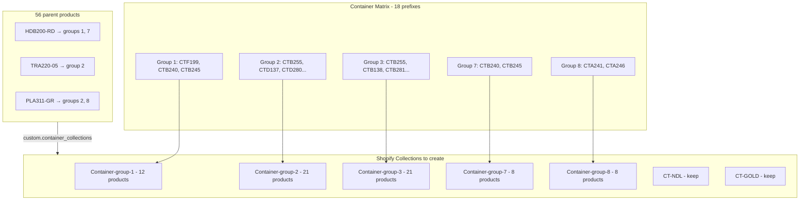

# Container Group Migration Plan

## Task context

**Teamwork task:** [39587509] Setup container options from BC picklists (27 active trees) — Petals.com Shopify Migration, 8h estimated, reopened by Mark on 17 Jun 2026.

**What's already done (no theme work needed):**
- Container picker UI, cart nesting, and in-cart change flow are implemented in Eurus
- Metafield upgraded to plural **`custom.container_collections`** (list of collection references) — see [`snippets/container-picker.liquid`](snippets/container-picker.liquid)
- ~56 parent products were manually assigned SKU-named collections in April 2026 — **Mark wants this redone** with numbered groups

**What Mark changed (17 Jun comment):**
- Replace SKU-titled collections with **`Container-group-{N}`** collections
- Populate groups via **SKU prefix matching** (e.g. `CTB255` → all `CTB255-*` variants)
- Keep **`CONTAINER-NDL`** and **`CONTAINER-GOLDCOVER`** free options (Shopify today: `CT-NDL`, `CT-GOLD`)
- Delete all SKU-named container group collections

Source files:
- [`tmp/Task Details[39587509] - 21 June 2026.html`](tmp/Task%20Details%5B39587509%5D%20-%2021%20June%202026.html)
- Google Sheet: https://docs.google.com/spreadsheets/d/1tPouT96i1qsz57n8DsWIY5SfHBhRu3BtRi9oQXR8KGc/edit

---

## Source data (both tabs received)

### 1. Container Matrix — prefix → group membership

File: [`tmp/Petals container groups - Container Matrix.csv`](tmp/Petals%20container%20groups%20-%20Container%20Matrix.csv)

**18 container SKU prefixes** mapped to groups 1, 2, 3, 7, 8 (`X` = member):

| Group | Prefixes | Est. products (BC catalog) |
|-------|----------|----------------------------|
| **1** | `CTF199`, `CTB240`, `CTB245` | **12** — validates exactly against Mark's example |
| **2** | `CTB255`, `CTD137`, `CTD280`, `CTD119`, `CTD216`, `CTD200`, `CTD251` | **21** |
| **3** | `CTB255`, `CTB138`, `CTB281`, `CTB103`, `CTB217`, `CTB203`, `CTB252` | **21** |
| **7** | `CTB240`, `CTB245` | **8** |
| **8** | `CTA241`, `CTA246` | **8** |

**Prefixes appearing in multiple groups** (products appear in more than one collection — picker deduplicates by product):

| Prefix | Groups |
|--------|--------|
| `CTB255` | 2, 3 |
| `CTB240` | 1, 7 |
| `CTB245` | 1, 7 |

**Group 1 validation (Mark's example — confirmed):**

> `CTF199-SWH`, `CTF199-BCP`, `CTF199-LGH`, `CTF199-SBK`, `CTB240-BCP`, `CTB240-LGH`, `CTB240-SBK`, `CTB240-SWH`, `CTB245-HBR`, `CTB245-GGY`, `CTB245-MBK`, `CTB245-SAW`

All 12 SKUs resolve from the three group-1 prefixes against the BC product catalog.

### 2. Parent product assignments — product → group(s)

File: [`tmp/Petals container groups - Plants & trees container groups.csv`](tmp/Petals%20container%20groups%20-%20Plants%20%26%20trees%20container%20groups.csv)

| Column | Meaning |
|--------|---------|
| `Item #` | Parent product SKU (e.g. `HDB200-RD`, `TRA220-05`) |
| `C Group 1` / `C Group 2` | **Slot columns** — cell values are actual group numbers (1, 2, 3, 7, or 8) |

**56 parent products:** 4 poinsettias (`HDB`), 30 floor plants (`PLA`), 22 trees (`TRA`/`TRC`/`TRF`/`TRM`)

| Pattern | Count | Example |
|---------|-------|---------|
| Two groups | 34 | `HDB200-RD` → **1 + 7** |
| One group | 24 | `TRA220-05` → **2**; `TRA220-06` → **3** |

**SKU format note:** Spreadsheet uses `HDB200-RD` (hyphenated). Match against live Shopify SKUs at execution.

---

## Target architecture



**Five collections to create:**

| Title | Handle | Prefixes |
|-------|--------|----------|
| Container-group-1 | `container-group-1` | CTF199, CTB240, CTB245 |
| Container-group-2 | `container-group-2` | CTB255, CTD137, CTD280, CTD119, CTD216, CTD200, CTD251 |
| Container-group-3 | `container-group-3` | CTB255, CTB138, CTB281, CTB103, CTB217, CTB203, CTB252 |
| Container-group-7 | `container-group-7` | CTB240, CTB245 |
| Container-group-8 | `container-group-8` | CTA241, CTA246 |

---

## Current Shopify state → migration mapping

The April setup created **one collection per matrix prefix** — these map 1:1 to the matrix rows and should all be **deleted** after migration:

`CTB255`, `CTD137`, `CTB138`, `CTD280`, `CTB281`, `CTD119`, `CTB103`, `CTD216`, `CTB217`, `CTF199`, `CTD200`, `CTB203`, `CTB240`, `CTA241`, `CTD251`, `CTB252`, `CTB245`, `CTA246`

Also delete: `random` (not in matrix, likely test collection)

**Keep:** `CT-NDL`, `CT-GOLD`

**Review during audit:** `5ft-tree-containers`, `Containers-1` — legacy from BC manifest work, may be orphaned

Source: [`tmp/shopify-collections.json`](tmp/shopify-collections.json)

---

## Execution phases

### Phase 0 — Normalize source CSVs

Convert both exports into working files (e.g. `scripts/container-groups/` or `petals/docs/`):

**`container-group-prefixes.csv`** — 26 rows (some prefixes appear twice):

```csv
group_number,sku_prefix
1,CTF199
1,CTB240
1,CTB245
2,CTB255
...
```

**`container-group-assignments.csv`** — 92 rows (56 products × 1–2 groups):

```csv
parent_sku,group_number
HDB200-RD,1
HDB200-RD,7
TRA220-05,2
...
```

### Phase 1 — Audit current Shopify vs spreadsheet

1. Export products with `custom.container_collections` set (Matrixify or Admin GraphQL)
2. Compare current metafield values against 56-row assignments CSV
3. Flag mismatches from April manual entry
4. Record which parents currently have `CT-NDL` / `CT-GOLD` attached

### Phase 2 — Resolve container products by prefix

1. Pull **live Shopify** product catalog (BC CSV is fallback only)
2. For each `(group_number, sku_prefix)`: match `product.sku.startsWith(prefix)`
3. Output `container-group-products.csv`
4. Confirm group 1 = 12 products; sanity-check counts for groups 2–8 (~21, 21, 8, 8)

### Phase 3 — Create and populate collections

Create 5 manual collections; add all matched container products.

**Tooling:** Matrixify (reviewable diffs) or Admin GraphQL script (`collectionCreate` + `collectionAddProducts`).

### Phase 4 — Update parent metafields (56 products)

For each assignments row:

1. Resolve parent by SKU
2. Set `custom.container_collections` to:
   - Assigned `Container-group-{N}` collection(s)
   - Retained `CT-NDL` / `CT-GOLD` if currently attached
3. Remove all 18 SKU-named collection references

**Example:** `HDB200-RD` → `[container-group-1, container-group-7, ct-ndl, ct-gold]`

Picker shows the **union** of containers from all assigned groups (deduplicated).

### Phase 5 — QA

| Check | Sample |
|-------|--------|
| Two-group plant | `HDB200-RD` — groups 1 + 7 containers (~12 + 8, minus CTB240/245 overlap) |
| One-group 5' tree | `TRA220-05` — group 2 only (~21 containers) |
| One-group 6' tree | `TRA220-06` — group 3 only (~21 containers) |
| Two-group XL plant | `PLA311-GR` — groups 2 + 8 |
| Prefix expansion | `CTB255` in group 2 includes `-SBK` and `-SIV` variants |
| Free options | NDL and Gold Cover still appear |
| Cart | Nested container line + change link |

### Phase 6 — Cleanup

1. Confirm zero products reference old SKU-named collections
2. Delete 18 matrix-prefix collections + `random`
3. Export backup of old mappings first
4. **Do not delete** `CT-NDL`, `CT-GOLD`

---

## Relationship to BC tree manifest

[`petals/docs/bc-container-set-groups.csv`](file:///Users/smonsen/repos/petals/docs/bc-container-set-groups.csv) (23 silk tree sets from BC GraphQL) is **superseded** by the numbered-group matrix for the 22 tree SKUs in the assignments CSV. Review `5ft-tree-containers` during audit.

---

## Open questions (resolve at execution)

1. **Rename free-option collections?** — Keep `CT-NDL`/`CT-GOLD` handles or rename to `CONTAINER-NDL`/`CONTAINER-GOLDCOVER`?
2. **Bulk tool preference** — Matrixify import vs scripted Admin API?
3. **SKU matching** — confirm live Shopify SKUs for poinsettias (`HDB200-RD` vs `HDB200RD`)

---

## Deliverables

1. Normalized `container-group-prefixes.csv` + `container-group-assignments.csv`
2. Audit report: current vs target metafield state for 56 products
3. Matrixify import files OR GraphQL script
4. QA results on representative products
5. Cleanup of 18 SKU-named collections

Both spreadsheet tabs are now available — **ready to execute** once open questions above are decided.
