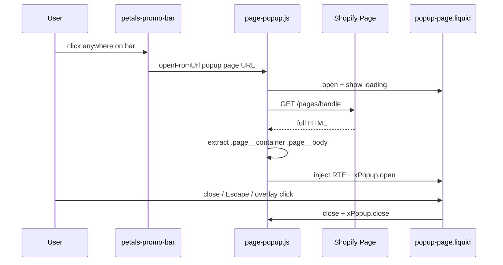

# Promo Bar Page Popup Plan

## Goal

When a customer clicks **anywhere on the promo bar**, open a centered modal with that promotion's Shopify Page content—without leaving the current page. "DETAILS" is part of the bar copy (visual CTA), not a separate link. Merchants manage popup content via standard Shopify Pages (RTE body).

## Key behavior change (from screenshot)

On the reference site, the **entire announcement bar is one click target**—not just the "DETAILS" text. Our implementation must match that.

## Current state

- **Promo bar today** = stock Eurus [`sections/announcement-bar.liquid`](sections/announcement-bar.liquid) in [`sections/header-group.json`](sections/header-group.json).
- That section splits promo text and a separate button/link; only the button would navigate—and today `button_link` is empty anyway.
- **We will not edit** `announcement-bar.liquid`. Instead, create a Petals-owned replacement and swap it in the header group.

## Architecture



## Implementation

### 1. Page popup JS — `assets/page-popup.js`

Create `Alpine.store('xPagePopup')` following the Petals modal store pattern (`open`, `loading`, `cachedResults`, `close()`).

**Primary trigger — promo bar click:**
- `openFromUrl(url)` is called directly from the custom promo bar section (see §2).
- Parses URL, strips `popup` query param for fetch, extracts `.page__container .page__body` innerHTML (same as [`assets/coupon-code.js`](assets/coupon-code.js)).
- Cache by page path; show loading spinner and fallback message on failure.

**Secondary trigger — site-wide link delegation (optional, kept for flexibility):**
- Intercept clicks on any same-origin `a[href]` containing `popup=1` or `popup=true`.
- Useful if other theme areas later link to popup pages the same way.

**Page load behavior:**
- Direct visit to `/pages/handle?popup=1` shows the normal full page (no auto-open). The param is for click-triggered modals only.

### 2. Custom promo bar section — `sections/petals-promo-bar.liquid` (NEW)

A **slim Petals section**, not a fork of the 2,400-line Eurus announcement bar. Follows naming conventions of existing Petals sections like [`sections/petals-rich-text.liquid`](sections/petals-rich-text.liquid).

**Scope (MVP):**
- Single full-width bar, centered promo message
- Entire bar is the click target (`cursor-pointer`, `role="button"`, keyboard Enter/Space)
- No side toolbar, language/currency selectors, or promo-code copy blocks (out of scope for this bar)

**Section settings:**
| Setting | Purpose |
|---------|---------|
| `enable` | Show/hide bar |
| `show_only_on_homepage` | Optional homepage-only (match Eurus behavior) |
| `background_color` / `text_color` | Bar styling (migrate from current `#f7f2ea` config) |
| `text` | Rich text / HTML promo copy (e.g. "SUMMER SAVINGS • $25 OFF… • DETAILS") |
| `text_size` | Font scale |
| `popup_page` | **Page picker** (`type: "page"`) — source for modal content |
| `enable_sticky_bar` | Optional sticky top (reuse Eurus sticky pattern) |

**Markup pattern:**
```liquid
<div
  id="x-announcement"
  class="petals-promo-bar ..."
  role="button"
  tabindex="0"
  aria-label="View promotion details"
  data-page-popup-url="{{ section.settings.popup_page.url }}?popup=1"
  @click="$store.xPagePopup.openFromUrl($el.dataset.pagePopupUrl)"
  @keydown.enter.prevent="$store.xPagePopup.openFromUrl($el.dataset.pagePopupUrl)"
  @keydown.space.prevent="$store.xPagePopup.openFromUrl($el.dataset.pagePopupUrl)"
>
  <div class="petals-promo-bar__message">{{ section.settings.text }}</div>
</div>
```

**Why keep `id="x-announcement"`:**
- [`assets/theme.js`](assets/theme.js) and [`assets/mobile-dock.js`](assets/mobile-dock.js) use this ID for header height / sticky offset calculations. Reusing it avoids regressions in header layout.

**Optional later:** blocks + Splide carousel if multiple rotating promos each need their own popup page. MVP is one message + one page.

### 3. Modal snippet — `snippets/popup-page.liquid`

New snippet modeled on [`snippets/promo-code-detail.liquid`](snippets/promo-code-detail.liquid) and [`snippets/popup-price-detail.liquid`](snippets/popup-price-detail.liquid):

- Fixed overlay at `z-[100]` (match Petals modals)
- `x-show="$store.xPagePopup.open"` with enter/leave transitions
- Close button, `@keyup.escape`, overlay `@click.self`
- Wire `xPopup.open` / `xPopup.close()` and `xModal.focus()` / `removeFocus()`
- Content area: loading spinner, `#page-popup-content` with `page.css`, `class="rte page__body"`
- No separate title header—RTE body is self-contained

### 4. Register in layout — [`layout/theme.liquid`](layout/theme.liquid)

After existing Petals popup snippets (~line 232):

```liquid

<script src="{{ 'page-popup.js' | asset_url }}" defer></script>
```

Always load (not gated on `enable_featured_discount`).

### 5. Swap header group — [`sections/header-group.json`](sections/header-group.json)

Replace the `announcement-bar` section entry with `petals-promo-bar`:

- Migrate existing promo text, colors, and `custom_css` (uppercase, letter-spacing, border-bottom, hide SVG arrow, code pill styling)
- Remove the old `announcement-bar` section from the group (stock section file stays in repo untouched for theme updates)
- Set `popup_page` to the new Shopify Page once created

**Do not edit** [`sections/announcement-bar.liquid`](sections/announcement-bar.liquid).

### 6. Optional CSS — `assets/whirlwind.css`

- `.petals-promo-bar` — full-width click affordance, text alignment, uppercase/letter-spacing if not handled via section `custom_css`
- `.page-popup-content` — modal max-width (~650px), scroll behavior for two-column RTE layouts

### 7. Merchant setup

1. **Create a Shopify Page** (e.g. handle `summer-savings-details`):
   - Turn off page heading in theme editor so standalone visits don't duplicate the modal title
   - RTE body: heading, image, promo code, terms (HTML columns as in screenshot)
2. **Theme editor → Header → Petals promo bar** → select the page in **Popup page**
3. Paste promo copy into **Text** including "DETAILS" as plain text at the end

## Files to create / modify

| File | Action |
|------|--------|
| [`assets/page-popup.js`](assets/page-popup.js) | **Create** — store, fetch, cache, `openFromUrl()` |
| [`snippets/popup-page.liquid`](snippets/popup-page.liquid) | **Create** — modal shell |
| [`sections/petals-promo-bar.liquid`](sections/petals-promo-bar.liquid) | **Create** — full-bar clickable promo strip |
| [`layout/theme.liquid`](layout/theme.liquid) | **Edit** — render snippet + script |
| [`sections/header-group.json`](sections/header-group.json) | **Edit** — swap to `petals-promo-bar`, migrate settings |
| [`assets/whirlwind.css`](assets/whirlwind.css) | **Edit** (optional) — bar + modal styling |

**Explicitly untouched:**
- [`sections/announcement-bar.liquid`](sections/announcement-bar.liquid) — stock Eurus section preserved

## Testing checklist

- Click anywhere on promo bar (text, padding, edges) → modal opens, no navigation
- Keyboard: Tab to bar, Enter/Space → modal opens
- Close via X, Escape, overlay click → modal closes, scroll restored
- Second open → uses cache
- Header sticky offset still correct (`#x-announcement` height)
- Mobile: bar readable, modal scrollable, close button reachable
- Direct visit to `/pages/handle` (no param) → full page renders normally
- Theme editor: bar preview works; popup page picker saves correctly

## Out of scope

- Editing stock Eurus `announcement-bar.liquid`
- Dedicated popup page template / `?section_id=` fetch — RTE body only
- Auto-opening modal on direct `?popup=1` page visits
- Carousel / multiple promo slides (optional follow-up)
- Side toolbar, language/currency, promo-code copy button on this bar

## Risk / notes

- **RTE-only extraction** — only `.page__body` content appears in the modal; merchants put all popup content in the page body.
- **Full-bar click** — no nested links inside the bar in MVP; if menu links are needed later, add a slim toolbar outside the clickable region.
- **Header group JSON is auto-generated** — swapping sections may be re-done in theme editor; document the manual steps for production.
